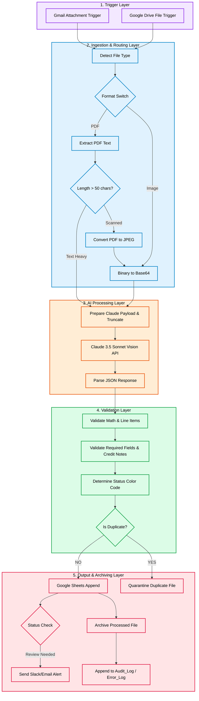
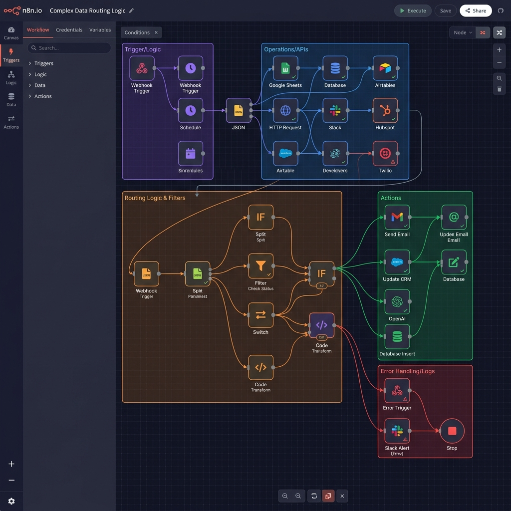

# 📑 OmniExtract: Enterprise AI Invoice Data Extractor

  

  

**Intelligent. Resilient. Fully Automated.**

An enterprise-grade, fault-tolerant document processing and auditing system built in **n8n**. OmniExtract automates the ingestion, extraction, deterministic auditing, compliance classification, duplicate prevention, and archiving of complex invoice files at scale.

---

## 📚 Documentation & Guides

Whether you are a developer deploying the system or an operator maintaining it, everything you need is documented:

* 🚀 **[Zero-to-Hero Installation Guide](docs/INSTALLATION.md)** - Step-by-step GCP setup and n8n Docker deployment.
* 🛡️ **[Enterprise Security Audit](docs/ENTERPRISE_AUDIT.md)** - Learn how this architecture scales securely.
* 🛠️ **[Day 2 Maintenance Protocol](docs/MAINTENANCE.md)** - Monitoring, backup, and safe update strategies.

---

## 🌟 Key Capabilities

* ✅ **Multimodal Ingestion:** Dynamically processes clean text-based PDFs, scanned image-based PDFs, and direct JPEGs/PNGs.
* ✅ **Claude 3.5 Sonnet Engine:** Extracts complex nested tables and metadata with custom multimodal prompting and 3-retry exponential backoff protection.
* ✅ **Deterministic Auditing:** Performs strict mathematical assertion checks on line items vs. subtotals.
* ✅ **Compliance Triage:** Classifies invoices dynamically into `AUTO_APPROVED` 🟢, `REVIEW_RECOMMENDED` 🟡, and `REVIEW_REQUIRED` 🔴.
* ✅ **Zero-Duplicate Architecture:** Auto-diverts duplicate submittals to quarantine folders while keeping the master Google Sheet pristine.
* ✅ **Dead-Letter Telemetry:** Logs granular processing durations and Claude token usage to dedicated audit tracking sheets.

---

## 📊 Enterprise Pipeline Architecture

The following diagram illustrates the 5 distinct operational layers within the n8n pipeline.

---

## 📸 Visual Demo Assets (Strategy)

To make this repository visually compelling for stakeholders, place the following screenshots in the `/assets/` directory (these are currently placeholders to be updated by the developer):

1. **`assets/01-n8n-canvas.png` (The Brain):** A wide, zoomed-out shot of the beautiful 26-node n8n canvas demonstrating the scale and visual branching of the logic.
2. **`assets/02-google-sheets-dashboard.png` (The Output):** A close-up of the `Sheet1` ledger. Showcase the conditional formatting—rows glowing Green (Auto-Approved) alongside Red (Review Required) rows to prove the triage works.
3. **`assets/03-claude-multimodal.png` (The Intelligence):** A split-screen shot. On the left, a blurry/scanned PDF invoice. On the right, the perfectly structured JSON output generated by Claude 3.5 Sonnet.
4. **`assets/04-duplicate-quarantine.png` (The Safety Net):** An email screenshot of the high-priority "Duplicate Alert" showing that the system successfully caught and blocked a double-submittal.

> **Note to Junior Dev:** Take these 4 screenshots on your local deployment and update the image tags below!

### Platform Previews

---

## 📜 License
Licensed under the [MIT License](LICENSE).
