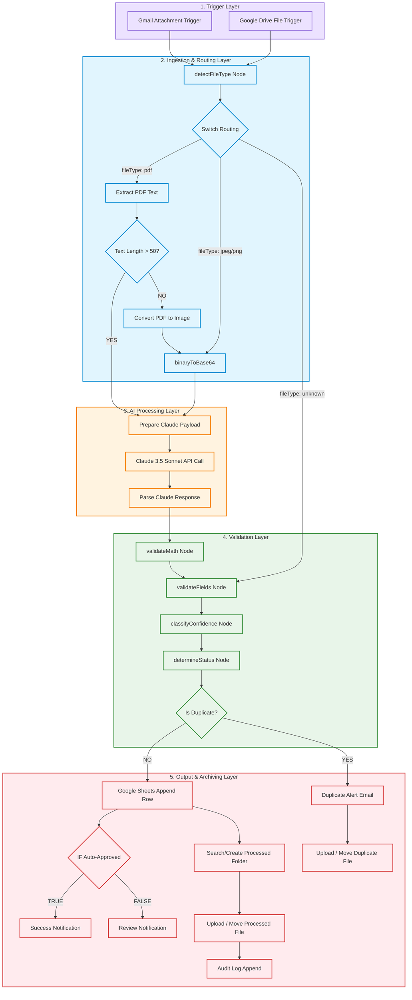

# 📑 AI Invoice Data Extractor System (Phase 05 Final Production Release)

[](https://n8n.io)
[](https://anthropic.com)
[](https://google.com/sheets)
[](LICENSE)

An enterprise-grade, fault-tolerant, and intelligent document processing and auditing system built in **n8n**. It automates the ingestion, extraction, deterministic auditing, compliance classification, duplicate prevention, and archiving of invoice files.

---

## 🚀 Key Features

* ✅ **Multimodal Ingestion:** Handles clean text-based PDFs, scanned (image-based) PDFs via Page-1 300 DPI conversion, and direct JPEG/PNG files.
* ✅ **Claude 3.5 Sonnet Integration:** Performs dynamic data extraction with custom multimodal templates and 3-retry exponential backoff protection.
* ✅ **Deterministic Auditing:** Deep-compares line item sums vs. subtotals, and calculates expected grand totals with math discrepancy assertions.
* ✅ **Automatic Compliance States:** Classifies invoices into `AUTO_APPROVED` (Green), `REVIEW_RECOMMENDED` (Amber), and `REVIEW_REQUIRED` (Red) based on audit flags and confidence scoring.
* ✅ **Deterministic Duplicate Prevention:** Searches Google Sheets and auto-diverts double-submittals to a Google Drive `/Duplicates/` folder while keeping the original spreadsheet clean.
* ✅ **Automated File Archiving:** Dynamically generates monthly folders (`/Invoices/Processed/YYYY-MM/`) and uploads Gmail attachments or moves existing Drive files seamlessly.
* ✅ **Dead-Letter Audit Logging:** Maintains high-fidelity `Audit_Log` and `Error_Log` tabs with execution durations, token usages, and priority admin notifications.

---

## 📊 Pipeline Architecture (Mermaid.js Flowchart)



---

## 📂 Project Directory Structure

```text
/ai.invoice.data.extractor
│
├── /workflows
│   └── workflow.json          # Main importable 26-node n8n Phase 05 JSON
│
├── /scripts
│   └── sheets_trigger.gs      # Google Apps Script conditional formatting trigger
│
├── /docs
│   ├── PHASE_01_GUIDE.md      # Phase 01: Gmail text-based extraction guide
│   ├── PHASE_02_GUIDE.md      # Phase 02: Multimodal vision & routing guide
│   ├── PHASE_03_GUIDE.md      # Phase 03: Validation and audit logic guide
│   └── PHASE_04_GUIDE.md      # Phase 04: Google Sheets & archiving guide
│
├── README.md                  # Main premium project summary and presentation
├── PHASE_05_GUIDE.md          # Technical setup and duplicate testing protocols
└── LICENSE                    # MIT open-source license
```

---

## 🎨 Professional Google Sheets Cell Formatting

New sheet rows are automatically color-coded with bolded compliance metrics to make the sheet highly professional and easy to parse:

* **Column P (Status):**
  * `AUTO_APPROVED` turns solid green (**#34A853**) with white text.
  * `REVIEW_RECOMMENDED` turns solid amber (**#FBBC04**) with black text.
  * `REVIEW_REQUIRED` turns solid red (**#EA4335**) with white text.
* **Column R (Avg Confidence):**
  * `>= 85%` turns bold green text.
  * `65%` to `84%` turns bold amber text.
  * `< 65%` turns bold red text.
* **Column S (Low Confidence Fields):**
  * If fields are present, background highlights light red (**#F4CCCC**).

---

## 🛠️ Installation & Setup Guide

### 1. n8n Import
1. Download `/workflows/workflow.json` from this repository.
2. In your n8n cloud or self-hosted workspace, click **Add Workflow** > **Import from File** (or copy JSON and paste directly onto the editor canvas).
3. Bind your credentials to the Google Sheets, Gmail, and Header Auth (Claude API Key) nodes.

### 2. Google Sheets Setup
1. Create a Google Spreadsheet.
2. Setup three sheets named:
   * **`Sheet1`:** Main metadata ledger with column headers `Timestamp` to `Flags` (Columns A to U).
   * **`Audit_Log`:** Performance and token tracker (`Timestamp`, `Filename`, `Final Status`, `Processing Duration`, `Tokens Used`).
   * **`Error_Log`:** Error ledger (`Timestamp`, `Source File`, `Error Stage`, `Error Message`).
3. Bind the Google Apps Script (`/scripts/sheets_trigger.gs`) inside **Extensions** > **Apps Script** as an installable **On Change** trigger as described in `/docs/PHASE_04_GUIDE.md`.

---

## 📹 Visual Demo (Placeholders)

### n8n Active Pipeline Canvas


### Automatically Formatted Google Sheets Ledger


### Stakeholder Review Required Alert Email


---

## 📜 License
Licensed under the [MIT License](LICENSE).
